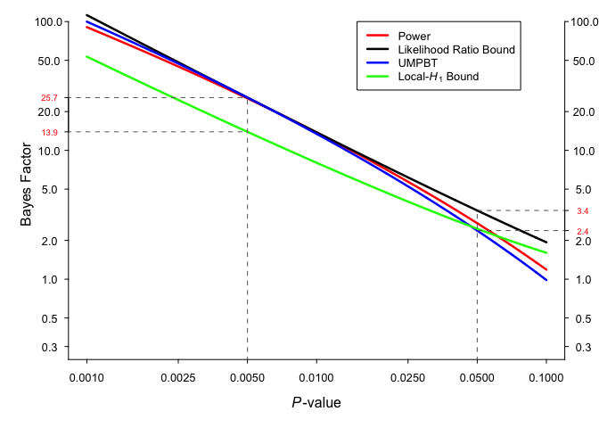
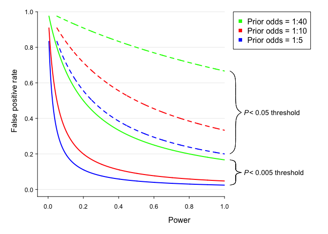

Change your alpha
================
Rick Gilmore and Brad Wyble
2017-10-09 13:40:48

-   [What researchers should do](#what-researchers-should-do)
-   [Why should they do this](#why-should-they-do-this)
-   [Replicating Benjamin et al. Figure 1](#replicating-benjamin-et-al.-figure-1)
-   [Replicating Benjamin et al. Figure 2](#replicating-benjamin-et-al.-figure-2)

What researchers should do
--------------------------

-   Make *α* = .005 the new standard for Null Hypothesis Statistical Testing for *new discoveries*
-   Label findings with .005 &lt; *p* &lt; .05 as 'suggestive'

Why should they do this
-----------------------

-   Practical, actionable, understandable, will improve reproducibility
-   Fits with current practices & training thus potential for broad adoption
-   Doesn't require overhauling the machinery of inference
-   *p* &lt; .005 consistent with stronger evidence in favor of *H*1 under various scenarios
-   Would substantially reduce false positive rates

Replicating Benjamin et al. Figure 1
------------------------------------

Replicating Benjamin et al. Figure 2
------------------------------------

