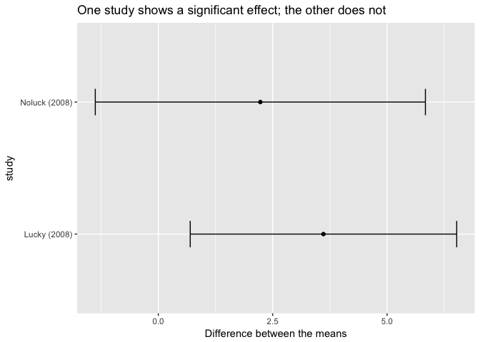
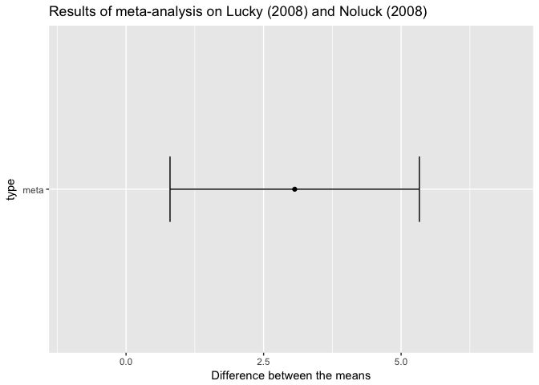

Change your alpha
================
Rick Gilmore and Brad Wyble
2017-10-11 07:55:13

-   [What researchers should do](#what-researchers-should-do)
-   [Why should they do this](#why-should-they-do-this)
-   [Cummings 2012 Fig 1.1](#cummings-2012-fig-1.1)
-   [Cummings 2012 Fig 1.2](#cummings-2012-fig-1.2)
-   [Benjamin Fig 1](#benjamin-fig-1)
-   [Benjamin Fig 2](#benjamin-fig-2)
-   [Sources](#sources)

What researchers should do
--------------------------

-   Make *α* = .005 the new standard for Null Hypothesis Statistical Testing for *new discoveries*
-   Label findings with .005 &lt; *p* &lt; .05 as 'suggestive'
-   Focus attention on accumulating evidence ([Cummings 2012 Fig 1.1](##cummings-2012-fig-1.1); [Cummings 2012 Fig 2](#cummings-2012-fig-1.2))

Why should they do this
-----------------------

-   Practical, actionable, understandable, will improve reproducibility
-   Fits with current practices & training thus potential for broad adoption
-   Doesn't require overhauling the machinery of inference
-   *p* &lt; .005 consistent with [stronger evidence in favor of *H*1](#benjamin-fig-1) under various scenarios
-   Would substantially [reduce false positive rates](#benjamin-fig-2)

Cummings 2012 Fig 1.1
---------------------

[Cummings 2012](https://thenewstatistics.com/itns/)

    ## [1] 6.5225241 0.6974759

    ## [1]  5.837991 -1.377991

Cummings 2012 Fig 1.2
---------------------

[Cummings 2012](https://thenewstatistics.com/itns/)

    ## [1] 3.065533

    ## [1] 0.7992624 5.3318032

Benjamin Fig 1
--------------

Benjamin Fig 2
--------------

Sources
-------

Benjamin, D. J., Berger, J., Johannesson, M., Nosek, B. A., Wagenmakers, E.-J., Berk, R., Bollen, K., et al. (2017). Redefine statistical significance. *Nature Human Behavior*, full text available from <http://rdcu.be/v4Sr>. [Supplemental material](https://static-content.springer.com/esm/art%3A10.1038%2Fs41562-017-0189-z/MediaObjects/41562_2017_189_MOESM1_ESM.pdf).

Cumming, G. (2013). Understanding The New Statistics: Effect Sizes, Confidence Intervals, and Meta-Analysis. Routledge. Retrieved from <https://market.android.com/details?id=book-1W6laNc7Xt8C>
